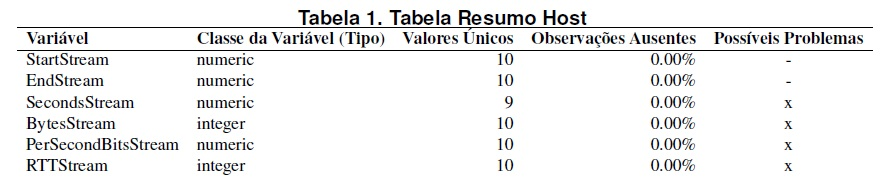
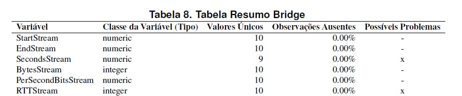

# Análise Estatística descritiva

_Autores:Mogleson Lima, Michel Sousa._

## Introdução

A principio faz necessário uma breve introdução sobre os ambientes nos quais foram coletados os dados.
A ideia central do nosso trabalho é realizar compação de métricas de contêineres Docker acerca da perspectiva do uso de drivers distintos.
Os cenários foram criados em um ambiente de nuvem publica(AWS), onde foram criados 2 instâncias EC2. Foram ultilizados dois drivers apenas, o Host e o bridge.

## Rersumo das métricas

Abaixo segue duas tabelas com as métricas coletadas durante os testes.

**Tabela 1 - Métricas Driver Host**

**Tabela 2 - Métricas Driver Bridge**

## Acerca das variáveis

1.  EndStream:
    Tempo o qual se localiza o fim da transmissão de cada fluxo.

    

## Algumas análises e considerações acerca das métricas.

Aqui terá uma breve análise acerca das métricas coletadas...
