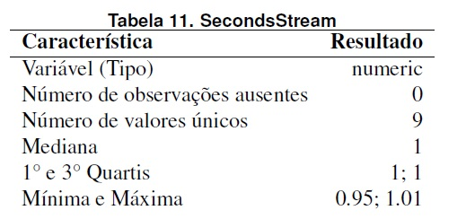

# Análise Estatística descritiva

_Autores:Mogleson Lima, Michel Sousa._

# Introdução

A principio se faz necessário uma breve descrição acerca da ideia central de nosso trabalho. O qual foi idealizado com intuito de analizar o desempenho da rede de comunicação entre contêineres Docker, visando testar o desempenho diante do uso de diferentes drivers. Atualmente conseguimos elaborar dois cenários, um usando driver Host e outro com driver Bridge, onde realizamos testes para identificar a taxa de transferencia com Iperf3, e testes de latência com Sockperf. A seguir seguem amostras destes dados e algumas informações que conseguimos extrair acerca dos mesmos.

## Resumo das métricas
Abaixo seguem as tabelas resumo dos dados coletados no experimento.

**Métricas Driver Host**

**Métricas Driver Bridge**

## Acerca das variáveis

### 01. StartStream:
Tempo o qual se localiza o inicio de transmissão de cada fluxo.

**Métricas Driver Host**

**Métricas Driver Bridge**

### 02. EndStream:
Tempo o qual se localiza o final de transmissão de cada fluxo.

**Métricas Driver Host**

**Métricas Driver Bridge**

### 03. SecondsStream:
Tempo em milissegundos que a transmissão do fluxo levou.

**Métricas Driver Host**

**Métricas Driver Bridge**

### 04.  BytesStream:
Total de bytes transmitido durante cada fluxo.

**Métricas Driver Host**

**Métricas Driver Bridge**

### 05. PerSecondsBitsStream:
Taxa de bits por segundo transmitida du-
rante cada fluxo.

**Métricas Driver Host**

**Métricas Driver Bridge**

### 06. RTTStream:
O tempo total necessário para um pacote percorrer do ponto de origem até o ponto de destino, e o retorno sinalizando que o pacote foi recebido com sucesso.

**Métricas Driver Host**

**Métricas Driver Bridge**

# Algumas análises e considerações acerca das métricas.

### 01. StartStream:

**Métricas Driver Host**

**Métricas Driver Bridge**

### 02. EndStream:

**Métricas Driver Host**

**Métricas Driver Bridge**

### 03. SecondsStream:
Tempo em milissegundos que a transmissão do fluxo levou.

**Métricas Driver Host**

Aqui temos uma observação a ser feita, podemos notar que o valor “1.01” pode
ser considerado como outlier (valor anômalo).

**Métricas Driver Bridge**

Observação: Podemos notar que o valor "1.01" pode ser considerado como outlier.

### 04.  BytesStream:
Total de bytes transmitido durante cada fluxo.

**Métricas Driver Host**

Neste caso, temos duas observações cujos valores são “115593840” e
“115964528”.

**Métricas Driver Bridge**

### 05. PerSecondsBitsStream:

**Métricas Driver Host**

Aqui, podemos considerar como outliers os valores “924752594.06” e
“927570596.68”.

**Métricas Driver Bridge**

### 06. RTTStream:

**Métricas Driver Host**

Neste caso, o valor “642”  ́e um outlier, visto a sua maior distância em relação aos demais valores observados.

**Métricas Driver Bridge**

Neste caso, o valor "3986" é um outlier, visto sua distância significável em relação aos demais valores.